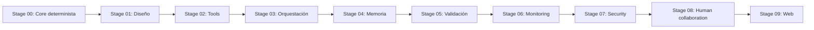

# Estructura de la Presentación

Este repo está organizado como un laboratorio didáctico inspirado en los temas centrales de *Building Applications with AI Agents*: diseño de sistemas, uso de tools, orquestación, memoria, validación, monitoreo, seguridad y colaboración humano-agente.

## Estrategia de ramas y tags

Cuando el repositorio tenga su primer commit base, la recomendación operativa es:

- ramas principales:
  - `student-start`
  - `instructor-solution`
- tags de progreso:
  - `stage-00-core`
  - `stage-01-design`
  - `stage-02-tools`
  - `stage-03-orchestration`
  - `stage-04-memory`
  - `stage-05-validation`
  - `stage-06-monitoring`
  - `stage-07-security`
  - `stage-08-human-collaboration`
  - `stage-09-web`

`student-start` debe contener TODOs guiados. `instructor-solution` debe quedar completamente funcional y ser la base para cortar los tags por stage.

## Roadmap didáctico

| Stage | Min | Pregunta guía | Runtime principal | Comando sugerido |
| --- | ---: | --- | --- | --- |
| `stage-00-core` | 8 | ¿Qué parte del problema debemos resolver sin IA? | CLI | `python -m scripts.tasks stage-e2e stage-00-core` |
| `stage-01-design` | 10 | ¿Este problema realmente necesita un agente? | Specs | `python -m scripts.tasks stage-e2e stage-01-design` |
| `stage-02-tools` | 12 | ¿Qué puede hacer el agente? | CLI/API | `python -m scripts.tasks stage-e2e stage-02-tools` |
| `stage-03-orchestration` | 12 | ¿Quién decide el siguiente paso? | CLI/API | `python -m scripts.tasks stage-e2e stage-03-orchestration` |
| `stage-04-memory` | 8 | ¿Qué debe recordar y qué no? | CLI/API | `python -m scripts.tasks stage-e2e stage-04-memory` |
| `stage-05-validation` | 12 | ¿Cómo sabemos que el agente hizo bien su trabajo? | CLI | `python -m scripts.tasks stage-e2e stage-05-validation` |
| `stage-06-monitoring` | 8 | ¿Cómo sabemos qué pasó por dentro? | CLI/API/UI | `python -m scripts.tasks stage-e2e stage-06-monitoring` |
| `stage-07-security` | 10 | ¿Qué pasa si el usuario intenta romper el sistema? | CLI/API | `python -m scripts.tasks stage-e2e stage-07-security` |
| `stage-08-human-collaboration` | 8 | ¿Cuándo debe intervenir una persona? | CLI/API/UI | `python -m scripts.tasks stage-e2e stage-08-human-collaboration` |
| `stage-09-web` | 10 | ¿Cómo hacemos visible y utilizable el sistema completo? | API/UI | `python -m scripts.tasks stage-e2e stage-09-web` |

## Narrativa de clase



## Hilo conductor para explicar el laboratorio

1. Diseño: definimos límites y criterios de éxito.
2. Tools: damos capacidades controladas al agente.
3. Orquestación: decidimos el flujo y el orden de decisión.
4. Memoria: retenemos contexto útil y permitido.
5. Validación: medimos si el sistema realmente sirve.
6. Monitoring: hacemos observable lo que ocurrió.
7. Security: limitamos riesgos y permisos.
8. Human collaboration: diseñamos el punto de intervención humana.
9. Web: convertimos el sistema en una experiencia visible y defendible.

## Comandos del instructor

```bash
python -m scripts.tasks list-stages
python -m scripts.tasks stage-info stage-03-orchestration
python -m scripts.tasks stage-test stage-05-validation
python -m scripts.tasks stage-e2e stage-09-web
```

## Material complementario

- índice de stages: [docs/stages/index.md](/home/aldo/@utp/utp-schedule-agent-lab/docs/stages/index.md)
- escenario del taller: [scenarios/utp_semester_planning/spec.md](/home/aldo/@utp/utp-schedule-agent-lab/scenarios/utp_semester_planning/spec.md)
- diseño base: [src/schedule_agent/design/scenario_spec.md](/home/aldo/@utp/utp-schedule-agent-lab/src/schedule_agent/design/scenario_spec.md)
