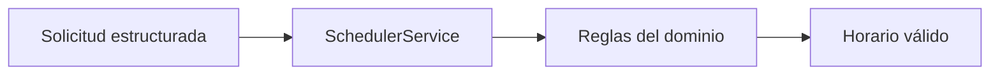

# Stage 00: Core Determinista

## Pregunta guía

¿Qué parte del problema debemos resolver sin IA?

## Conceptos a explicar

- reglas de negocio
- datos sintéticos
- choques de horario
- provincia, virtualidad y laboratorios

## Ejecución

```bash
python -m scripts.tasks seed
python -m scripts.tasks run-core
python -m scripts.tasks test
```

## Actividad

Ejecutar el core y nombrar las reglas que nunca deberían depender del modelo.

## Señal de éxito

- el CLI devuelve una recomendación
- `tests/core` pasan
- el grupo diferencia lógica determinista de interpretación


