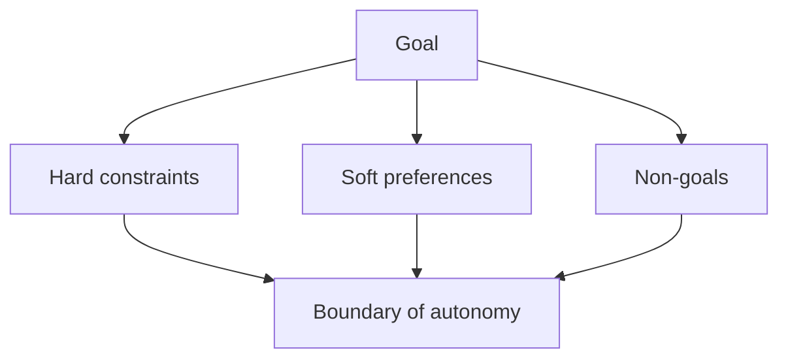

# Stage 01: Design

## Pregunta guía

¿Este problema realmente necesita un agente?

## Conceptos a explicar

- goal
- non-goals
- hard constraints
- soft preferences
- risks
- success criteria

## Ejecución

```bash
python -m scripts.tasks stage-info stage-01-design
python -m scripts.tasks stage-test stage-01-design
```

## Actividad

Leer el escenario y completar una restricción faltante.

## Señal de éxito

- existen `scenario_spec.md`, `constraints.md` y `architecture.md`
- el grupo puede explicar por qué el sistema no debe matricular
- `tests/stage_01_design` pasan


