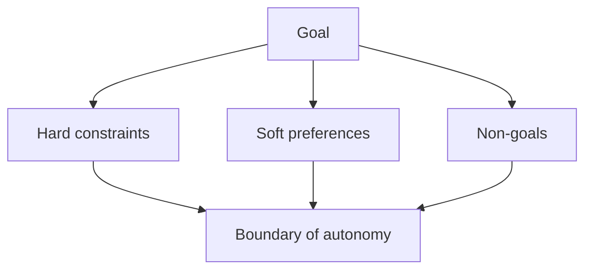

# Stage 01: Design

## Pregunta guía

¿Este problema realmente necesita un agente?

## Conceptos a explicar

- goal y non-goals
- hard constraints y soft preferences
- riesgos de autonomía
- criterios de éxito observables
- alineación con el libro: diseñar el sistema antes del prompting

## Ejecución

```bash
python -m scripts.tasks stage-info stage-01-design
python -m scripts.tasks stage-test stage-01-design
```

## Actividad

Leer [scenario_spec.md](/home/aldo/@utp/utp-schedule-agent-lab/src/schedule_agent/design/scenario_spec.md), detectar una restricción faltante y acordar si pertenece a hard constraint, preferencia o non-goal.

## Señal de éxito

- existen `scenario_spec.md`, `constraints.md` y `architecture.md`
- todos tienen material suficiente para guiar el stage
- la clase puede explicar por qué el agente no debe matricular

## Diagrama


