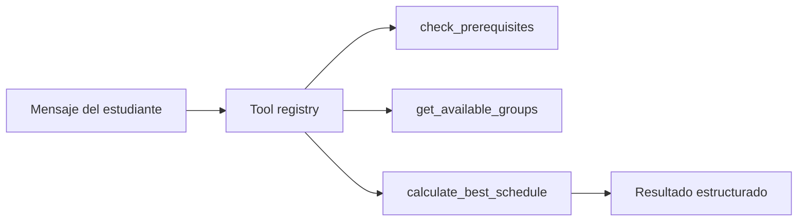

# Stage 02: Tools

## Pregunta guía

¿Qué puede hacer el agente?

## Conceptos a explicar

- tools read-only
- tools de cálculo
- tools de validación
- tools de escalamiento humano
- contratos tipados y observabilidad de llamadas

## Ejecución

```bash
python -m scripts.tasks stage-e2e stage-02-tools
```

## Actividad

Implementar o revisar `check_prerequisites()` y `calculate_best_schedule()` enfocándose en input, output y errores esperados.

## Señal de éxito

- el agente usa tools en vez de resolver el horario “de memoria”
- las llamadas quedan registradas en `tool_calls`
- `tests/stage_01_tools` pasan

## Diagrama


