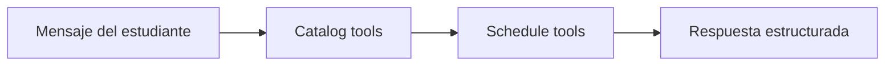

# Stage 02: Tools

## Pregunta guía

¿Qué puede hacer el agente?

## Conceptos a explicar

- tools read-only
- tools de cálculo
- tools de validación
- contratos tipados

## Ejecución

```bash
python -m scripts.tasks run-agent
python -m scripts.tasks stage-e2e stage-02-tools
```

## Actividad

Implementar o explicar `check_prerequisites()` y `calculate_best_schedule()`.

## Señal de éxito

- el agente usa tools explícitas
- `tests/stage_01_tools` pasan
- la salida muestra tool calls estructuradas


