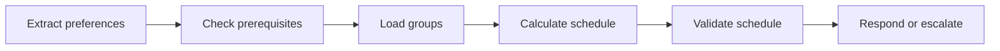

# Stage 03: Orchestration

## Pregunta guía

¿Quién decide el siguiente paso?

## Conceptos a explicar

- simple agent loop
- planner-executor
- state machine
- tool selection
- failure handling

## Ejecución

```bash
python -m scripts.tasks stage-e2e stage-03-orchestration
```

## Actividad

Completar el flujo `extract -> check -> calculate -> validate -> respond` y revisar cómo `AgentState` captura el progreso.

## Señal de éxito

- el orden del flujo es visible en el código y las trazas
- el agente no salta validaciones
- `tests/stage_02_orchestration` pasan

## Diagrama


