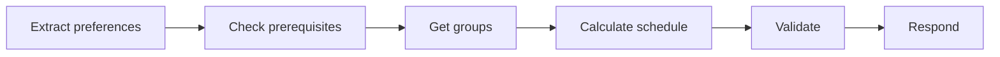

# Stage 03: Orchestration

## Pregunta guía

¿Quién decide el siguiente paso?

## Conceptos a explicar

- simple agent loop
- planner-executor
- state machine ligera
- orden de tool calls

## Ejecución

```bash
python -m scripts.tasks stage-info stage-03-orchestration
python -m scripts.tasks stage-e2e stage-03-orchestration
```

## Actividad

Completar o explicar el flujo `extract -> check -> calculate -> validate -> respond`.

## Señal de éxito

- el agente devuelve `plan`
- las tools aparecen en el orden esperado
- `tests/stage_02_orchestration` pasan


