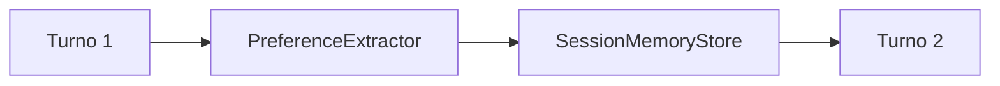

# Stage 04: Memory

## Pregunta guía

¿Qué debe recordar y qué no?

## Conceptos a explicar

- session memory
- preferencias del usuario
- límites de persistencia
- contexto útil entre turnos

## Ejecución

```bash
python -m scripts.tasks stage-e2e stage-04-memory
```

## Actividad

Probar que el agente recuerde “no puedo viernes” en el siguiente turno.

## Señal de éxito

- el agente persiste preferencias útiles
- `tests/stage_03_memory` pasan
- el `memory_snapshot` cambia entre turnos de forma controlada


