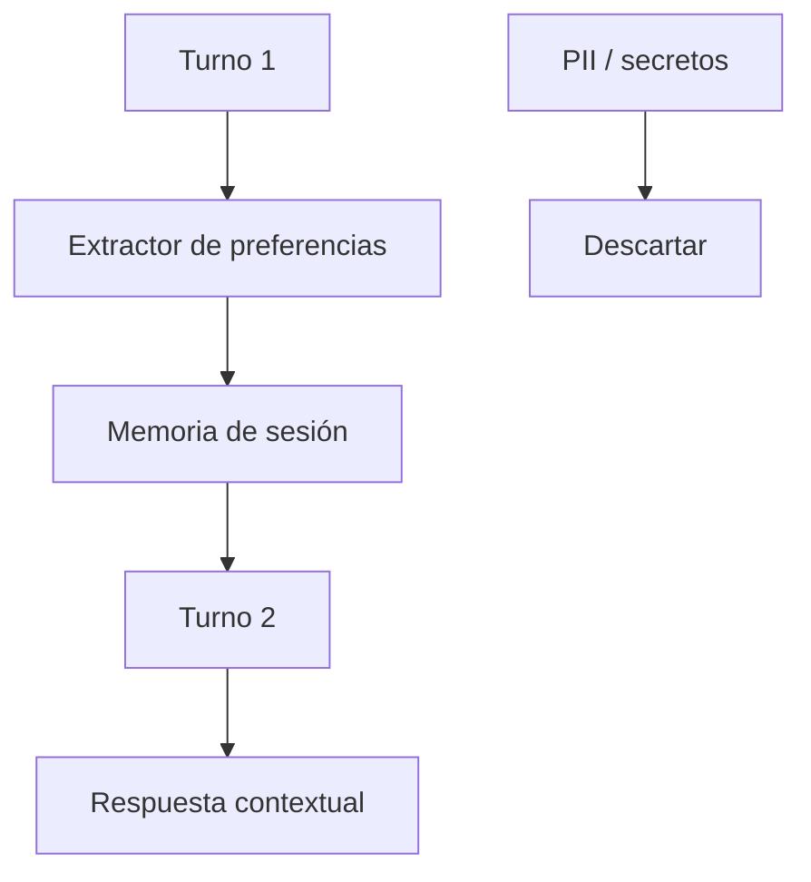

# Stage 04: Memory

## Pregunta guía

¿Qué debe recordar y qué no?

## Conceptos a explicar

- session memory
- preferencias del usuario
- perfil académico
- límites de datos sensibles
- memoria útil vs acumulación peligrosa

## Ejecución

```bash
python -m scripts.tasks stage-e2e stage-04-memory
```

## Actividad

Enviar un turno con “no puedo viernes” y luego otro con una materia obligatoria para verificar que la preferencia siga presente.

## Señal de éxito

- la memoria reutiliza preferencias permitidas
- no guarda credenciales ni instrucciones maliciosas
- `tests/stage_03_memory` pasan

## Diagrama


