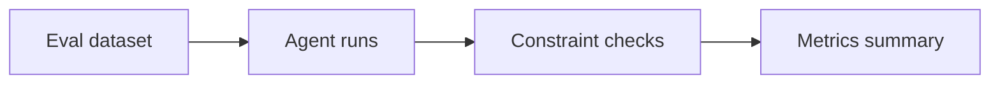

# Stage 05: Validation

## Pregunta guía

¿Cómo sabemos que el agente hizo bien su trabajo?

## Conceptos a explicar

- hard constraints
- soft constraints
- eval set
- metrics
- regression testing

## Ejecución

```bash
python -m scripts.tasks eval
python -m scripts.tasks stage-e2e stage-05-validation
```

## Actividad

Ejecutar la evaluación y discutir qué métrica faltaría antes de producción.

## Señal de éxito

- existe un summary cuantitativo
- `tests/stage_04_validation` pasan
- el grupo puede explicar cada métrica


