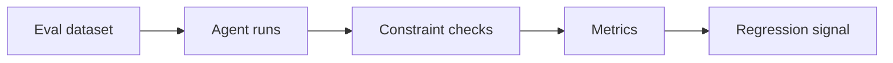

# Stage 05: Validation

## Pregunta guía

¿Cómo sabemos que el agente hizo bien su trabajo?

## Conceptos a explicar

- hard constraints
- soft constraints
- eval set
- métricas
- regression testing

## Ejecución

```bash
python -m scripts.tasks stage-e2e stage-05-validation
```

## Actividad

Ejecutar la evaluación y decidir si el sistema está listo para un demo, para un piloto o solo para laboratorio.

## Señal de éxito

- el equipo entiende cada métrica del summary
- se detecta al menos un riesgo residual
- `tests/stage_04_validation` pasan

## Diagrama


