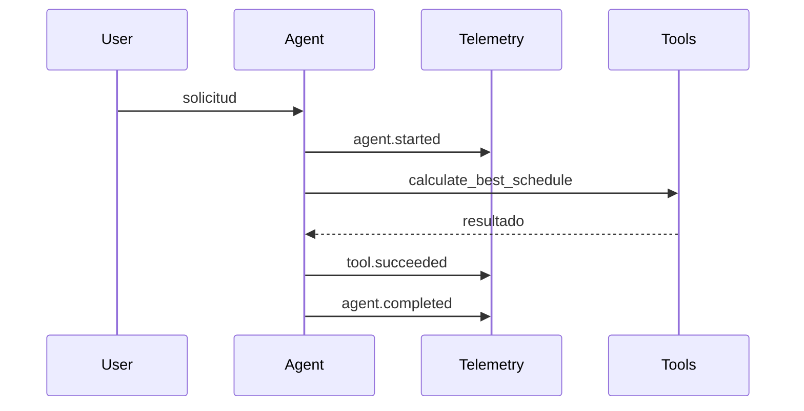

# Stage 06: Monitoring

## Pregunta guía

¿Cómo sabemos qué pasó por dentro?

## Conceptos a explicar

- tool calls
- latencia
- errores
- validation failures
- trace timeline

## Ejecución

```bash
python -m scripts.tasks stage-e2e stage-06-monitoring
```

## Actividad

Abrir las trazas, ubicar una tool call y explicar cómo esa evidencia ayuda a depurar una mala recomendación.

## Señal de éxito

- existen eventos como `tool.called` y `agent.completed`
- la clase puede seguir una ejecución de punta a punta
- `tests/stage_05_monitoring` pasan

## Diagrama


