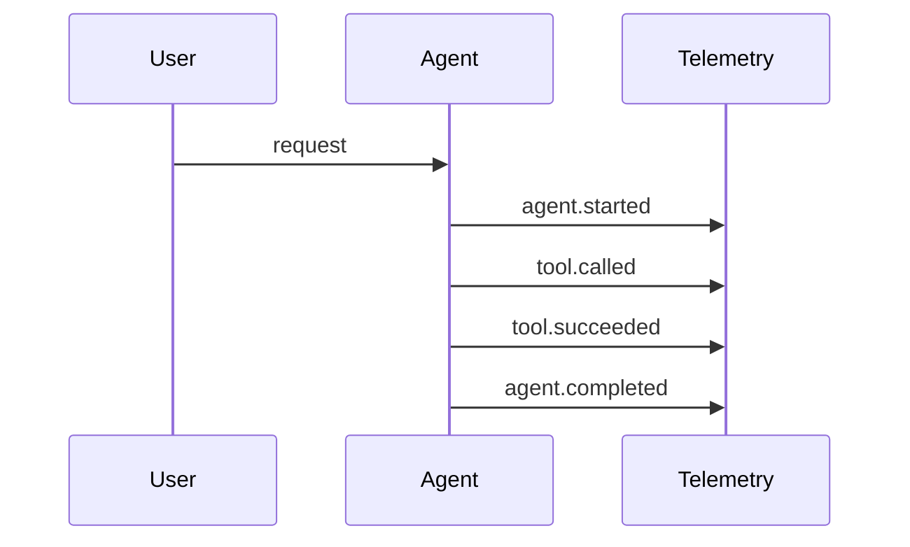

# Stage 06: Monitoring

## Pregunta guía

¿Cómo sabemos qué pasó por dentro?

## Conceptos a explicar

- tool calls
- latencia
- trazas
- timeline de ejecución
- API de observabilidad

## Ejecución

```bash
python -m scripts.tasks run-agent
python -m scripts.tasks trace
python -m scripts.tasks stage-e2e stage-06-monitoring
```

## Actividad

Seguir una ejecución en el archivo de trazas y luego pedir la misma traza por API.

## Señal de éxito

- aparecen eventos `agent.started` y `agent.completed`
- `tests/stage_05_monitoring` pasan
- el instructor puede inspeccionar `/api/v1/sessions/{id}/trace`


