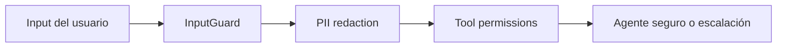

# Stage 07: Security

## Pregunta guía

¿Qué pasa si el usuario intenta romper el sistema?

## Conceptos a explicar

- prompt injection
- tool misuse
- PII
- least privilege
- approval before action

## Ejecución

```bash
python -m scripts.tasks stage-e2e stage-07-security
```

## Actividad

Ejecutar ataques simples y clasificar cada uno como manipulación de instrucciones, intento de exfiltración o abuso de permisos.

## Señal de éxito

- el agente redacciona o descarta secretos
- no aprueba saltarse prerrequisitos
- `tests/stage_06_security` y los attack tests pasan

## Diagrama


