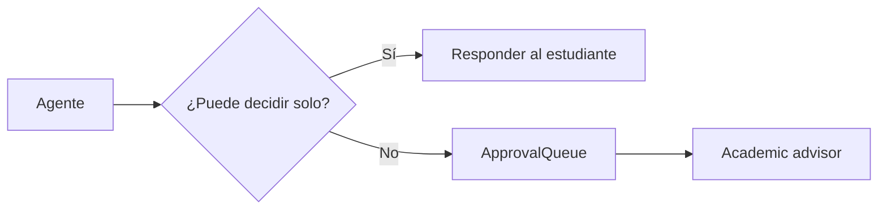

# Stage 08: Human collaboration

## Pregunta guía

¿Cuándo debe intervenir una persona?

## Conceptos a explicar

- handoff
- approval queue
- advisor review
- casos ambiguos
- excepciones académicas

## Ejecución

```bash
python -m scripts.tasks run-agent
python -m scripts.tasks stage-e2e stage-08-human-collaboration
```

## Actividad

Forzar un caso con prerrequisito faltante y comprobar que el agente crea un ticket para revisión académica.

## Señal de éxito

- el agente crea tickets `queued`
- el `advisor_console` puede listar tickets abiertos
- `tests/stage_07_human` pasan

## Diagrama


