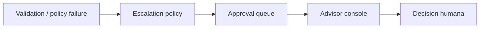

# Stage 08: Human Collaboration

## Pregunta guía

¿Cuándo debe intervenir una persona?

## Conceptos a explicar

- handoff
- approval queue
- advisor review
- low-confidence cases
- excepciones del dominio

## Ejecución

```bash
python -m scripts.tasks stage-e2e stage-08-human-collaboration
```

## Actividad

Forzar un caso con prerrequisito faltante y seguir el ticket hasta la cola de revisión.

## Señal de éxito

- la revisión humana aparece como ticket, no como texto ambiguo
- el agente explica por qué escaló
- `tests/stage_07_human` pasan

## Diagrama


