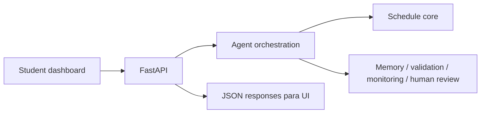

# Stage 09: Web

## Pregunta guía

¿Cómo hacemos visible y utilizable el sistema completo?

## Conceptos a explicar

- dashboard técnico para agentes
- chat, horario, tool calls y memoria en una sola vista
- explicabilidad visible
- exportación de horario
- integración API + frontend

## Ejecución

```bash
python -m scripts.tasks stage-e2e stage-09-web
python -m scripts.tasks run-api
python -m scripts.tasks run-web
```

## Actividad

Levantar la UI, recorrer un caso feliz y un caso con handoff humano, y luego exportar el horario semanal.

## Señal de éxito

- el dashboard expone chat, horario, validación y trazas
- el frontend solo consume la API
- `tests/web` pasan y `build-web` compila

## Diagrama


