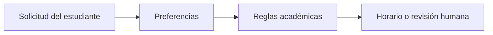

# UTP Semester Planning Scenario

## Objetivo del agente

Ayudar a un estudiante a planificar un semestre factible usando datos sintéticos.

## Entradas

- materias deseadas
- disponibilidad
- provincia
- materias obligatorias

## Salidas

- horario recomendado
- explicación
- escalamiento humano cuando aplique

