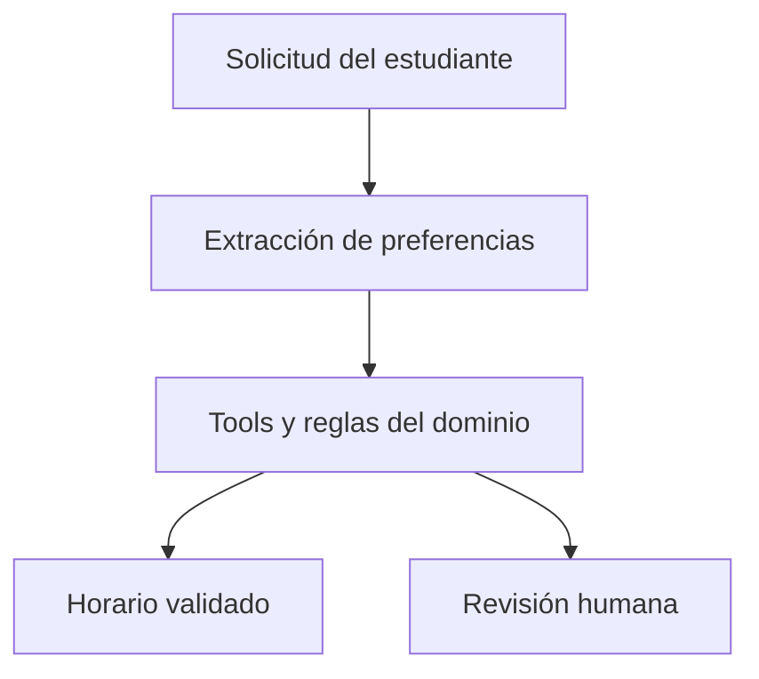

# UTP Semester Planning Scenario

## Contexto

El laboratorio modela a un estudiante de la UTP que quiere planificar su semestre usando datos sintéticos. El sistema no matrícula, no solicita credenciales y no depende de scraping vivo.

## Objetivo del agente

Entender restricciones del estudiante, consultar el catálogo sintético, validar prerrequisitos, calcular un horario factible, explicar la recomendación y escalar a revisión humana cuando corresponda.

## Inputs de ejemplo

- materias deseadas
- materias obligatorias
- disponibilidad horaria
- provincia o sede preferida
- historial académico sintético
- preferencias como “no puedo viernes” o “prefiero noche”

## Outputs esperados

- horario recomendado
- explicación breve y fundamentada
- validación de hard constraints
- advertencias
- ticket de revisión humana cuando aplique

## Casos de clase

1. Happy path: estudiante con prerrequisitos completos y preferencia de horario nocturno.
2. Conflict case: materias que generan choque o demasiada ociosidad.
3. Human review case: falta de prerrequisito o solicitud insegura.

## Diagrama

