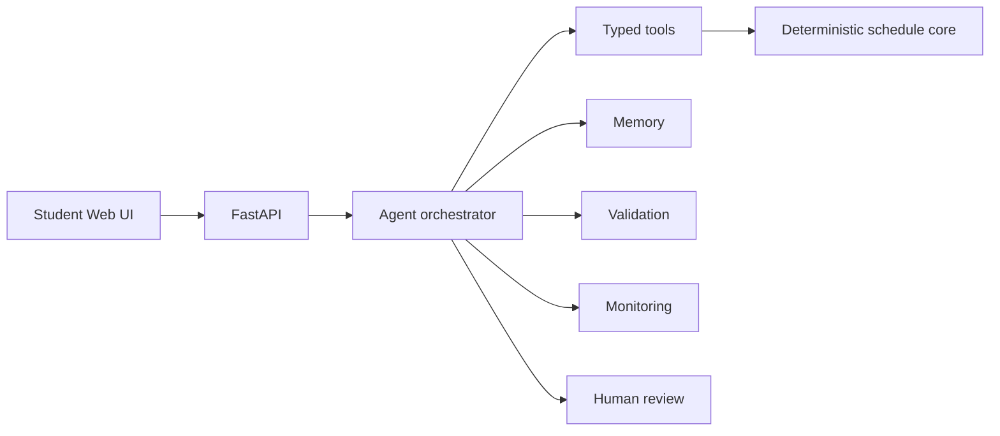

# Architecture

- `schedule_calculator` owns schedule computation and academic hard rules.
- `schedule_agent` owns extraction, orchestration, security, explanation, observability, and escalation.
- `apps/web` consumes only the API.

## Teaching Message

The LLM does not calculate the schedule. It decides how to use tools, explains results, and stops when human review is required.
