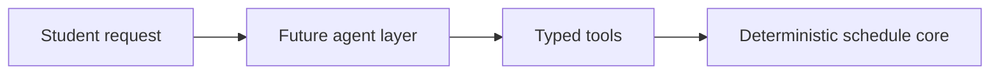

# Architecture

```mermaid
flowchart LR
  A["Student request"] --> B["Future agent layer"]
  B --> C["Typed tools"]
  C --> D["Deterministic schedule core"]
```

## Teaching Message

The LLM should not calculate schedules directly. The deterministic core remains the source of truth.
