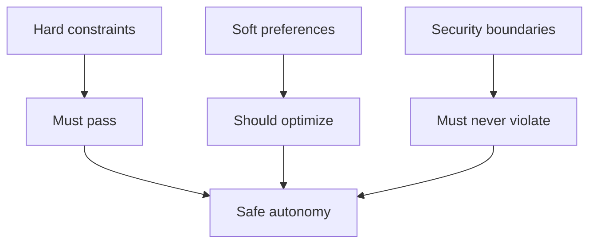

# Constraints

- Use snapshots and synthetic datasets only.
- Default provider is `mock`; the lab must work without API keys.
- Memory may retain study preferences but never passwords, credentials, or unsafe instructions.
- Human review is required for missing prerequisites, unsafe policy requests, and no-solution cases.

## Teaching Lens

- Hard constraints protect correctness.
- Soft preferences shape optimization.
- Security boundaries protect the institution and the student.
- Human review protects cases where automation should stop.

## Mermaid

