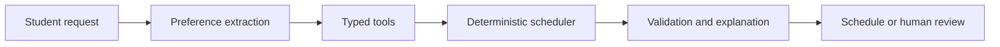

# Scenario Spec

## Goal

The agent helps a UTP student plan a feasible semester schedule using synthetic data, deterministic rules, and explainable tool calls.

## Student Story

An Ingeniería de Software student wants to plan the next term and may say:

> Quiero tomar Base de Datos II y Calidad de Software. Trabajo hasta las 5 p.m., no puedo viernes y Panamá es obligatoria para mí.

## Non-goals

- The agent must not enroll the student.
- The agent must not request UTP credentials.
- The agent must not bypass academic policy.
- The agent must not invent sections, prerequisites, or institutional rules.

## Hard constraints

- No schedule conflicts.
- Respect prerequisites.
- Required subjects must be prioritized.
- Physical classes must match province unless fully virtual.
- The deterministic scheduler still requires at least two enrollments for a final solution.

## Soft preferences

- Avoid Fridays.
- Prefer evening classes.
- Minimize idle time.
- Prefer the student's current province.

## Success Criteria

- The answer includes a valid schedule or a justified escalation.
- The explanation references real constraints from the system.
- The recommendation is reproducible with the same synthetic dataset.

## Mermaid

